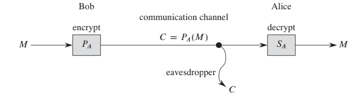
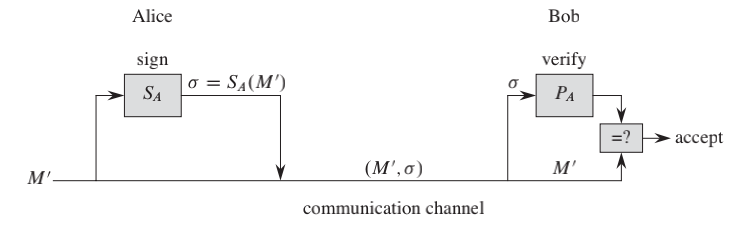

The Essence of RSA Cryptosystem
====================
# Contents
[toc]
# Overview
Number theory was once viewed as a beautiful but largely useless subject in pure mathematics. Today number-theoretic algorithms are used widely, due in large part to the invention of cryptographic schemes based on large prime numbers. These schemes are feasible because we can find large primes easily, and they are secure because we do not know how to factor the product of large primes efficiently.

In RSA, each participant has both a **public key** and a **secret key**. Secret keys are kept secret, but public keys can be revealed to anyone or even published.
# Usecase
* Encrypt messages
  
* Digital signature
  

# Concept
$$ M = S(P(M)) = P(S(M)) $$

# Implementation
## Algorithm
1. Select at random two large prime numbers $p$ and $q$ such that $p \neq q$. The primes
$p$ and $q$ might be, say, 1024 bits each.
2. Compute $n = pq$.
3. Select a small odd integer $e$ that is relatively prime to $\phi(n)$, which equals $(p-1)(q-1)$.
4. Compute $d$ as the multiplicative inverse of e, modulo $\phi(n)$.
5. Publish the pair $P = (e,n)$ as the participant’s RSA public key.
6. Keep secret the pair $S = (d,n)$ as the participant’s RSA secret key.

To transform a message $M$ associated with a public key $P = (e,n)$ compute
$ P(M) = M^e\ mod\ n$

To transform a ciphertext $C$ associated with a secrete key $S = (d,n)$ compute
$ S(C) = C^d\ mod\ n$

## Proof
We have that for any M,
$P(S(M)) = S(P(M))  = M^{ed}\ (mod\ n)$
...
$M^{ed} \equiv M\ (mod\ p)$
...
$M^{ed} \equiv M\ (mod\ q)$
By Chinese remainder theorem,
$M^{ed} \equiv M\ (mod\ n)$

# Miscs
* The security of the RSA cryptosystem rests in large part on the difficulty of factoring large integers
* Shor algorithm in quantum computer.
* In order to achieve security with the RSA cryptosystem, however, we should use integers that are quite long—hundreds or even more than one thousand bits long to resist possible advances in the art of factoring
* For efficiency, RSA is often used in a “hybrid” or “key-management” mode with fast non-public-key cryptosystems
* A hybrid approach to make digital signatures efficiently. This approach combines RSA with a public collision-resistant hash function h - a function that is easy to compute but for which it is computationally infeasible to find two messages $M$ and $M'$ such that $h(M) = h(M')$.
* We note that the use of certificates makes distributing public keys much easier.

# References
1. Thomas H. Cormen, Charles E. Leiserson, Ronald L. Rivest, and Clifford Stein. Introduction to Algorithms, chapter 31. The MIT Press, thrid edition, 2009
2. https://www.bilibili.com/video/av54679934/

