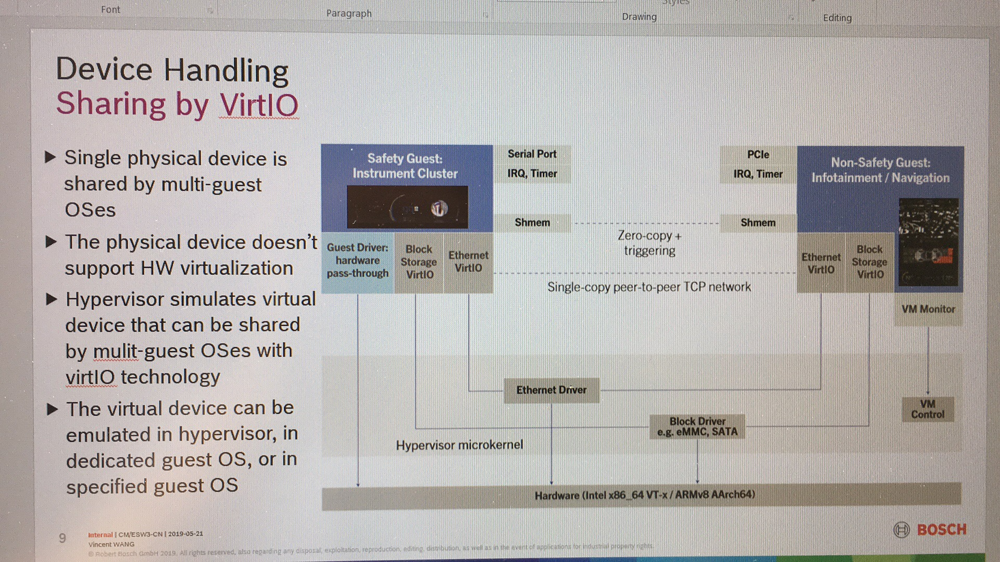
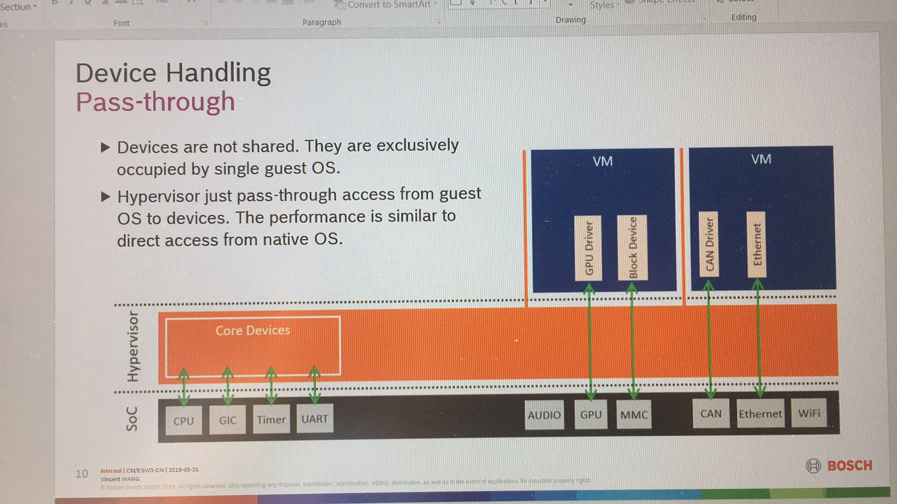
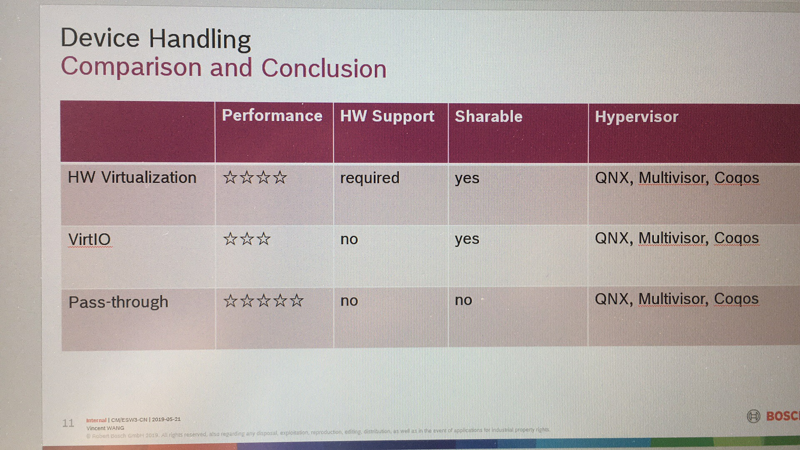

The Overview of Hypervisors
===================================================================================================

# Contents
[toc]

# Version
Version  | Date        | Author        | Changes
---------|-------------|---------------|-------------------------------------------------------------
v0.1     | 2019.08.25  | Jin Feng      | Initial version

# Overview
## Introduction
A Hypervisor also known as Virtual Machine Monitor (VMM) can be a piece of software, firmware or hardware that gives an impression to the guest machines(virtual machines) as if they were operating on a physical hardware. It allows multiple operating system to share a single host and its hardware. The hypervisor manages requests by virtual machines to access to the hardware resources (RAM, CPU, NIC etc) acting as an independent machine[26].

## History
Although server virtualization technology is currently receiving much attention, the concept is not new. Actually the idea came in the mid-1960s, when the Giants and expensive computers of the day reached to a high processing speed but they were unable to seize the expensive computing time due to management processes that needed to be done manually by the operator. To get the best out of expensive computer processing, it was necessary to run multiple processes in parallel. Thus arose the concept of time sharing, which culminated with the idea of virtualization.

Time Sharing: This concept means sharing time, i.e., idle time between the processes are shared with other processes to streamline the system. Multiple jobs are executed simultaneously, and the CPU meets each job for a little while, one by one in sequence. The time dedicated to each job are small enough so that users can interact with each program to recognize that there are no other programs running.

In 1972, an American computer scientist, Robert P. Goldberg introduced the theoretical basis of the architecture for virtual computer systems in his dissertation at Harvard University. In the same year IBM introduced a mainframe that was able to simultaneously run different operating systems under the supervision of a control program – hypervisor.

The IBM System 370 was the first commercial computer entirely designed for virtualization, with which, the operating system CP / CMS allows you to run multiple instances simultaneously. This was followed by the IBM z / VM, which took advantage of hardware virtualization. The VM / CMS is highly regarded and widely distributed in the industry and academia. Several modern approaches to virtualization implementations are very unique for mainframe of computers from IBM.

Over the years, virtualization has begun to fall by the wayside due to creation of new client / server applications and the decline of the mainframe platform that lost power before the rise of the x86 platform. According to VMWare, the widespread adoption of Windows and Linux as the operating system on servers in the 1990s eventually established the x86 architecture as the industry standard.

Due to high costs for the purchase of a mainframe, companies began to acquire x86 servers according to demand, this is a process called low-end (several small machines doing the work of a large dedicated server). In this scenario, instead of having a high initial cost with the purchase of a mainframe, they opt for purchasing smaller servers according to need.

The impact of this new strategy was to ensure  a good deal of backlash against hardware scaling problems, and most of these servers were used for a single application. Thus, according to International Data Corporation, in each implementation of a typical x86 server, the roof of CPU usage was between 10 to 15% of the total capacity of this server.

The servers were oversized for the application that would perform, and as a result, ended up suffering the same problem of mainframes of the 1960s, that is, not all took advantage of their computing power,  and were underutilized.

Then in 1999, VMware Inc. introduced the concept of virtualization on the x86 platform as a more efficient way to operate the equipment of the platform, taking advantage of x86 servers to provide a computational structure that would enable the full utilization of computational resources of these servers.

From 2005, processor manufacturers like Intel and AMD have given more attention to the need to improve hardware support in their products. Intel with its Intel VT and AMD with AMD-V. These hardware contains features which allow to exploit hypervisors that are used with the improved technique of virtualization (full virtualization) that make it easier to implement and enhance the performance[27].

In briefly, virtualization began in the 1960s, as a method of logically dividing the system resources provided by mainframe computers between different applications. Virtualization began and evolved on larger IBM mainframes, but the trend followed the evolution of computing into servers, desktops, and recently embedded devices[26].

## Embedded Hypervisor
Virtualization technology has shown immense popularity within embedded systems due to its direct relationship with cost reduction, better resource utilization, and higher performance measures. Efficient hypervisors are required to achieve such high performance measures in virtualized environments, while taking into consideration the low memory footprints as well as the stringent timing constraints of embedded systems.

Embedded hypervisors, targeting embedded systems and certain real-time operating system (RTOS) environments, are designed with different requirements when compared to desktop and enterprise systems, including robustness, security and real-time capabilities[34].

We will focus on Embedded Hypervisor, especially for automotive area in this article. 

# Market
## Automotive Market Treads

## Global Market Overview of Hypervisor
The current status and predictions from several organizations:
  - **Grand View Research, Inc.**[15]
    The global automotive hypervisor market size is expected to reach USD 698.2 million by 2025, growing at a CAGR of 33.2% from 2019 to 2025, according to a new study by Grand View Research, Inc. [15]
  - **VDC Research**
    
  - **Technavio** [18][28][29]
    

## Key players [17]
The market appears to be fairly fragmented with several players occupying the market share. Companies such as BlackBerry Ltd. and Mentor Graphics Corp. have intensified competition. Factors such as the growth of automotive electronics and the need for virtualization in the automotive domain will provide significant growth opportunities for automotive hypervisor manufacturers.
* BlackBerry Ltd.
* Mentor Graphics Corp.
* Opensynergy
* Green Hills
* Redbend
* Sasken Technologies Ltd.
* SYSGO AG
* Visteon Corp.
  
## Statistics
**Open Source**
Hypervisors                | Type | Area                                | Maturity                         | Note
---------------------------|------|-------------------------------------|----------------------------------|------------
KVM                        | 1    | Embedded, Desktop, Server           | Has Products in Server/Desktop   |
Xen                        | 1    | Embedded, Desktop, Server           | Has Products in Server/Desktop   |
Xvisor                     | 1    | Embedded                            |                                  |
General Dynamics (OKlabs)  | 1    | Embedded                            |                                  |
HIS(OpenRTOS)              | 1    | Embedded                            |                                  |
Intel ACRM                 | 1    | Embedded                            |                                  |
Kernkonzep                 | 1    | Embedded                            |                                  |
Micrium (Micro COS3)       | 1    | Embedded                            |                                  |
Siemens Jailhouse          | 1    | Embedded                            |                                  |
Sierraware on ARM          | 1    | Embedded                            |                                  |
Real-time Linux            | 1    | Embedded                            |                                  |
Perseus 32bit on XEN       | 1    | Embedded                            |                                  |
XEN-project                | 1    | Embedded                            |                                  |
Virtual Box                | 1    | Server, Desktop                     | Mature                           |

**Proprietary**
Hypervisors                | Type | Area                                | Maturity                         | Note
---------------------------|------|-------------------------------------|----------------------------------|------------
DDC-I (DEOS)               | 1    | Embedded                            |                                  |
eSOL (eT-kernel)           | 1    | Embedded                            |                                  |
Greenhills (Integrity)     | 1    | Embedded, IVI, IC                   | Mature                           |
Harman/Samsung (Red Bend)  | 1    | Embedded                            |                                  |
LynxOS                     | 1    | Embedded                            | Mature                           |
Mentor Graphics (Nucleus)  | 1    | Embedded                            | Mature                           |
Open Synergy (COQOS)       | 1    | Embedded, IVI                       | Mature                           |
Redbend                    | 1    | Embedded, IVI                       | -                                |
Perseus 64bit on ARM       | 1    | Embedded                            | Mature                           |
QNX (Neutrino)             | 1    | Embedded, IVI, IC                   | Mature                           |
Real-time Systems          | 1    | Embedded                            | Mature                           |
SYSGO AG (PikeOS)          | 1    | Embedded                            | Mature                           |
AG (PikeOS)                | 1    | Embedded                            | Mature                           |
Microsoft Hyper-V          | 1    | Desktop, Server                     | Mature                           |
VMware ESXI/ESX            | 1    | Desktop, Server                     | Mature                           |

## Conclusion[15]
https://finance.yahoo.com/news/automotive-hypervisor-market-size-worth-093500241.html
* The type 2 segment is expected to register the highest CAGR over the forecast period as these hypervisors allow various virtual machines to run simultaneously using different operating systems
* The passenger cars segment is expected to grow at a significant pace over the forecast period owing to the growing concerns pertaining to the safety and security of passenger cars
* The growing initiatives undertaken by governments in the developing countries to improve electric vehicle parc are expected to create new growth opportunities for the market players
* The increasing production of autonomous cars with entertainment and infotainment systems is creating growth opportunities for the players in the automotive hypervisor market
* The key players in the market include Continental AG; Renesas Electronics Corporation; NXP Semiconductor N.V.; Wind River Systems, Inc.; Green Hills Software LLC; Sasken Technologies Ltd.; and Mentor Graphics Corporation.

# Requirements
## Overall
An operating system running on a hypervisor doesn’t have access to real hardware resources. And because hypervisors virtualize software environments, they can be isolated from each other.
This is key for components with different ASIL levels. They can be kept separate, so they don’t need to be recertified for ISO 26262 with every system change. That’s why embedded hypervisors are important for compliance, particularly in the automotive industry. Plus, using hypervisors can protect safety-critical applications from hackers, too. 

The property of **isolation** can take effects on several aspects of automotive requirements
## Hardware reuse
expensive hardware
## IP reuse
run multiple OSes is IP reuse
## security[26][19][25]
TODO
## Safety
TODO

## Use cases [30]

## Chanllenges[15]
One of the challenges faced by the market is the lack of standards related to automotive virtualization.
### Safety
Currently, the only regulation to be followed by the market players is ISO 26262, a functional safety standard that regulates electronic and electrical systems throughout the product development lifecycle, from development to decommissioning. 
### Security
The lack of cybersecurity standards across the globe is leading to issues related to hacking. National Institute of Standards and Technology’s Cybersecurity Framework (U.S.),EU’s Regulation against Geo-IP-based blocking of EU member countries or economies (EU), and others have introduced cybersecurity standards.These standards are to be mandatorily followed by the automobile providers while manufacturing autonomous vehicles.
### Limits of virtualization[17]
Virtualization is incapable of reducing a trusted computing base (TCB), which is a vital component of the system's security. Moreover, virtualization alone cannot address all security requirements associated with embedded systems. Many such limitations of virtualization are expected to hinder the growth of the market over the forecast period.
### complications
Complications with the integration of all the devices and components in a common virtual software architecture; this factor is expected to act as a restraint to the market growth is impacting negatively on the growth of RFID tag market in the current market scenario.

# Concept
## Types
### Types
The comparison of virtualization hypervisor of the Type 1 hypervisor, it enables the hardware virtualization and the Type 2 hypervisor, it runs atop existing OSs.

[16]

### Type 1 Hypervisor

* This is also known as Bare Metal or Embedded or Native Hypervisor.
* It works directly on the hardware of the host and can monitor operating systems that run above the hypervisor.
* It is completely independent from the Operating System. 
* The hypervisor is small as its main task is sharing and managing hardware resources between different operating systems.
* A major advantage is that any problems in one virtual machine or guest operating system do not affect the other guest operating systems running on the hypervisor.

### Type 2 Hypervisor

* This is also known as Hosted Hypervisor.
* In this case, the hypervisor is installed on an operating system and then supports other operating systems above it.
It is completely dependent on host Operating System for its operations
* While having a base operating system allows better specification of policies, any problems in the base operating system a ffects the entire system as well even if the hypervisor running above the base OS is secure

### Type 0 Hypervisor [32]

* Some parts in the literature refer to embedded hypervisors as Type 0 hypervisors or un-hosted hypervisors. 
* The coining of these terms is related to the fact that embedded hypervisors are closer to the hardware when compared to Type 1 or Type 2 hypervisors. As shown in Fig 4, Type 1 hypervisors are often thought of to be integrated into the host operating system and in comparison embedded hypervisors run without a fully fledged operating system on the native device which means that it does not need an operating system to be integrated into and hence the tem un-hosted.
* Small size and sleek implementation 
* Support for independent execution but interactive coexistence of applications in a secure environment.
* Low latency communication and switching between system components.
* Being able to meet real time requirements of embedded applications and minimum affect on the performance.
* Minimum affect on system resources and fast response time.

## Vitualization
### Virtualization[31][33]

### Fullvitualization
In full virtualiztion, the guest operating system runs on top of a hypervisor that sits on the bare metal. the guest is unware that it is being virtualized and requires no changes to work in this configuration
* VMware server
* Oracle VM Virtual Box
* KVM
### Paravirtualization
In Paravitualization, the guest operating system is not only aware that ti is running on a hypervisor but includes code to make guest-to-hypervisor transitions more efficient
* QNX (QNX)
* Multivisor (Greenills)
* Coqos (Opensynergy)
### Hardware assisted Virtualization
TODO
### Conclusion

## Device Sharing
https://projectacrn.github.io/latest/introduction/index.html#acrn-device-model-architecture
### Sharing by HW Virtualization

### sharing by VirtIO

### pass-through

### Comparation

# Hypervisors
## Hypeervisors
The general rules of hypervisors are:
* The preformance of type 1 hypervisors outperform a type 2 hypervisor. 
* The features of type 2 hypervisors outperform a type 1 hypervisor. 
* The commercial company offers a well-established, stable hypervisor with excellent performance and features.
* The open source gives yourself the freedom, flexibility, and resources to access source code and build the foundation of hypervisor
* The index to measure the maturity is mass product

## KVM
### Overview
 [11]
KVM is production-ready for enterprise workloads with the features you need to support your physical and virtual infrastructure, at a lower operating cost. Choosing a virtualization option based on KVM has many advantages over other solutions, like VMware vSphere.[10]
### Architecture

### Characteristics
 Item                    | Conent
-------------------------|------------------------
Type                     | Type 1
License                  | Open Source, Proprietary
Vendor                   | Communicty, Citrix, Oracle
Host CPU                 | Arm, X86
Guest CPU                | Arm, X86
Platform                 |
Hypervisor Design        | Partially Monolithic
Virtualization Mode      | Full/Para
Communication            | 
Virtualized Devices      | CPU, Memory (/dev/kvm), User space emulator for guest hardware emulation(QEMU)
Host OS                  | Linux Kernel
Guest OS                 | 
Area                     | Server, Desktop, Embedded
CPU Overhead             |
Mem Overead              | 
Lock sync latency        |
Virtual Timer interrupt overhead |
Performance              | Host OS
Security                 |
Safety                   |
Maturity        |
Cost            |
Support         |
Tool            | Includes Mentor Embedded Sourcery™ CodeBench and Sourcery™ Analyzer for a complete integrated design environment (IDE)
Schedule        | Dynamic, allow forload balancing of the payload and priority-based execution to support stringent realtime and performance constraints.
Feature                  | QEMU.

## Xen

### Architecture

### Characteristics
 Item                    | Conent
-------------------------|------------------------
Type                     | Type 1
License                  | Open Source, Proprietary
Vendor                   | Communicty, Citrix, Oracle
Host CPU                 | Arm, X86
Guest CPU                | Arm, X86
Platform                 |
Hypervisor Design        | Micro-kernelized
Virtualization Mode      | Full/Para
Communication            | Event channel
Shared Devices           | CPU, MMU, IRQ Handling
Host OS                  | Dom0 is Linux Kernel
Guest OS                 | Android, AUTOSAR, Mentor Embedded Linux, Nucleus RTOS
Area                     | Server, Desktop, Embedded
CPU Overhead             |
Mem Overead              | 
Lock sync latency        |
Virtual Timer interrupt overhead |
Performance              | 2%(typical), 8%(worst), Linux kernel running as Dom0 performs slightly slower than Linux kernel running directly on hardware without Xen
Security                 |
Safety                   |
Maturity                 |
Cost            |
Support         |
Tool            | Includes Mentor Embedded Sourcery™ CodeBench and Sourcery™ Analyzer for a complete integrated design environment (IDE)
Schedule        | Dynamic, allow forload balancing of the payload and priority-based execution to support stringent realtime and performance constraints.
Feature                  | Dom0 has full access to underlying host hardware.

## Xvisor
### Overview
TODO
### Architecture

### Characteristics
 Item                    | Conent
-------------------------|------------------------
Type                     | Type 1
License                  | Open Source, Proprietary
Vendor                   | Communicty, Citrix, Oracle
Host CPU                 | Arm, X86
Guest CPU                | Arm, X86
Platform                 |
Hypervisor Design        | Monolithic
Virtualization Mode      | Full/Para
Communication            | 
Virtualized Devices      | CPU, Memory (/dev/kvm), User space emulator for guest hardware emulation(QEMU)
Host OS                  | Linux Kernel
Guest OS                 | 
Area                     | Server, Desktop, Embedded
CPU Overhead             |
Mem Overhead             | 
IO Overhead
Lock sync latency        |
Virtual Timer interrupt overhead |
Performance              | Less overhead, 
Security                 |
Safety                   |
Maturity                 |
Cost                     |
Support                  |
Tool                     | Includes Mentor Embedded Sourcery™ CodeBench and Sourcery™ Analyzer for a complete integrated design environment (IDE)
Cpu Schedule             | vCPU Scheduler and load balancer
Feature                  | Lightweight, Configurable guest OS
Advantanges              | Single software layer provides all virtualizations. No degradation in device driver performance
Disadvantages            | Lack of rich board and device driver support

## Mentor Embedded Hypervisor
| Item          | Conent                 | Note
----------------|------------------------|----------------
Type            | Type 1
Host CPU        | Arm
Guest CPU       | Arm
SoC             |
Hypervisor Design | Monolithic/Partially/Micro-kernelized
Virtualization Mode | Full/Para
Host OS         | NA
Guest OS        | Android, AUTOSAR, Mentor Embedded Linux, Nucleus RTOS
Area            | Automotive
CPU Overhead    |
Mem Overead     | 
Lock sync latency |
Virtual Timer interrupt overhead
Overall Performance
Communication   |
Shared Devices  |
Security        |
Safety          |
Maturity        |
Cost            |
Scalability     |
Support         |
Tool            | Includes Mentor Embedded Sourcery™ CodeBench and Sourcery™ Analyzer for a complete integrated design environment (IDE)
Schedule        | Dynamic, allow forload balancing of the payload and priority-based execution to support stringent realtime and performance constraints.
Feature         | Arm Trustzone, AMP/SMP,

http://s3.mentor.com/public_documents/datasheet/embedded-software/hypervisor-ds.pdf

## EB corbos Hypervisor
security, safety, and realtime
https://www.elektrobit.com/products/ecu/eb-corbos/hypervisor/

## ACRN [35][36]

### Overview[40]
Today’s connected devices are increasingly expected to support a range of hardware resources, operating systems, and software tools/applications. Virtualization is key to meet these broad needs, however, existing solutions don’t offer the right size and flexibility for IoT. Data center hypervisor code is too big, boot time is slow, doesn’t offer safety-critical capabilities, and requires too much overhead for embedded development. Proprietary solutions are expensive and make it difficult to deliver long-term product support.

Clearly there’s pressing need for a reference hypervisor that meets the unique needs of embedded development. ACRNT​ is the answer.

ACRNTM is a flexible, lightweight reference hypervisor, built with real-time and safety-criticality in mind, optimized to streamline embedded development through an open source platform

### History [37]
It was announced by the Linux Foundation in late March of 2018. A Big Little Hypervisor for IoT Development.

### Architecture[37]

### Charicteristics [38]
#### Index
 Item                    | Conent
-------------------------|---------------------------------------------------------------------
Type                     | Type 1
License                  | BSD (Open Source)
Vendor                   | Linux Foundation (Supported by Neusoft, Intel, APTIV, ADLink, and LG)
Host CPU                 | X86_64
Guest CPU                | X86_64
Platform                 | Apolla Lake [42]
Virt  Mode               | Para
Communication            | Event channel
Shared Devices           | vCPU, Device Emulation(vPIC, vLAPIC, vIOAPIC), Extended Device Emulation[41]
Host OS                  | Service OS (Linux) (OS neutral)
Guest OS                 | Linux, Android, Vxworks, Windows (OS neutral)
Area                     | IoT, Embedded, Automotive
CPU Overhead             | -
Mem Overhead             | -
GPU Overhead             | -
eMMC Overhead            | -
Performance              | 2% ?
Security                 | -
Safety                   | being able to reach safety critical certification 
Maturity                 | It's still early days for ACRN, and it's not yet clear who the major users will be[38]
Cost                     | -
Support                  | -
Tool                     | -
Schedule                 | -

#### Features [37]
* Small footprint
* Real time
* Built for embedded IoT
* Adaptability
* Open Source
* Safety Criticality

### Conclusion
**Advantages**
  * Please refer to features
  
**Disadvantges**
  * Lack of emphasis on security
  * Under development and not mature
  * IO latency is bad

**Actions**
  * Let's keep an eye on it

## Redbend
TODO

# Benchmark [14]
## CPU Overhead
### Dhrystone
TODO
## Memory bandwidth
### Cachebench
TODO
### Stream
TODO
## System scheduler performance
### Hackbench
TODO

# Conclusion
TODO

# References
1. https://en.wikipedia.org/wiki/Hypervisor
2. https://ieeexplore.ieee.org/document/7092793
3. https://www.techinformant.in/hypervisors-comparison-virtualization-introduction
4. https://www.golinuxhub.com/2014/07/comparison-type-1-vs-type-2-hypervisor.html
5. http://ijarcet.org/wp-content/uploads/IJARCET-VOL-5-ISSUE-5-1546-1550.pdf
6. https://www.embedded.com/design/operating-systems/4435211/KVM-ARM--The-Design-and-Implementation-of-the-Linux-ARM-Hypervisor
7. https://www.flexiant.com/2014/02/12/hypervisor-comparison-kvm-xen-vmware-hyper-v/
8. https://opensourceforu.com/2019/04/the-top-open-source-hypervisor-technologies/
9. https://vapour-apps.com/what-is-hypervisor/
10. https://www.redhat.com/en/topics/virtualization/kvm-vs-vmware-comparison
11. https://www.cnblogs.com/chensiqiqi/p/9162989.html
12. https://en.wikipedia.org/wiki/Comparison_of_platform_virtualization_software
13. https://en.wikipedia.org/wiki/Kernel-based_Virtual_Machine
14. http://xhypervisor.org/pdf/Embedded_Hypervisor_Xvisor_A_comparative_analysis.pdf
15. https://www.grandviewresearch.com/press-release/global-automotive-hypervisor-market
16. https://www.grandviewresearch.com/industry-analysis/automotive-hypervisor-market
17. https://finance.yahoo.com/news/insights-global-automotive-hypervisor-market-131551115.html
18. https://www.theinsightpartners.com/reports/automotive-hypervisor-market
19. https://wiki.automotivelinux.org/bof-hypervisor
20. https://wiki.automotivelinux.org/bof-hypervisor?s[]=agl&s[]=specifications&s[]=section&s[]=7&s[]=3
21. https://wiki.automotivelinux.org/eg-virt
22. https://at.projects.genivi.org/wiki/display/DIRO/Hypervisor+Project
23. https://www.ijser.org/researchpaper/A-comparative-study-of-Various-Hypervisors-Performance.pdf
24. http://www.ijicse.in/wp-content/uploads/2015/07/v2i3-14.pdf
25. https://www.perforce.com/blog/qac/how-automotive-hypervisors-enable-innovation-compliance
26. https://www.embedded.com/design/operating-systems/4441695/Embedded-hypervisors
27. https://www.esds.co.in/blog/virtualization-a-little-history/
28. https://www.marketsandmarkets.com/Market-Reports/automotive-hypervisor-market-124958216.html
29. https://www.businesswire.com/news/home/20190529005431/en/Global-Automotive-Hypervisor-Market-2019-2023-Adoption-Vehicl
30. https://at.projects.genivi.org/wiki/display/DIRO/Hypervisor+in+Automotive+-+Critical+Use+cases
31. https://www.unixarena.com/2017/12/para-virtualization-full-virtualization-hardware-assisted-virtualization.html/
32. https://www.astroarch.com/tvp_strategy/type-0-hypervisor-fact-or-fiction-17159/
33. https://pediaa.com/what-is-the-difference-between-full-virtualization-and-paravirtualization-in-cloud/
34. https://www.networkworld.com/article/3243262/what-is-a-hypervisor.html
35. https://www.sohu.com/a/244575396_391994
36. https://linux.cn/article-9651-1.html?utm_source=weibo
37. https://projectacrn.org
38. https://www.serverwatch.com/server-news/acrn-arrives-on-the-scene-as-a-mini-hypervisor-for-iiot.html
39. https://www.theregister.co.uk/2018/03/19/linux_foundation_acrn_hypervisor_project
40. https://projectacrn.org/wp-content/uploads/sites/59/2019/06/ACRN-One-Pager_MASTER_v0.8_20190620.pdf
41. https://projectacrn.github.io/latest/developer-guides/modularity.html
42. https://projectacrn.github.io/latest/reference/hardware.html

