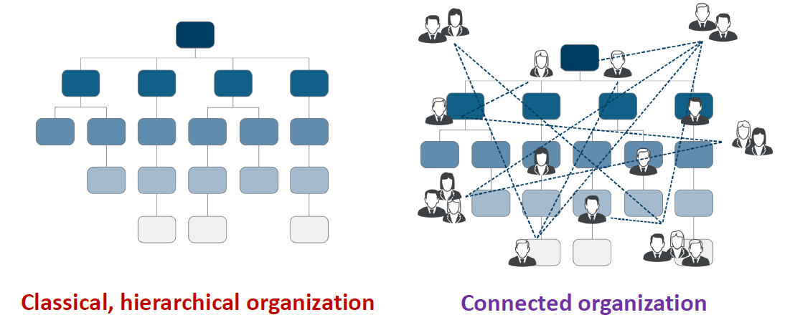

An Elastic Organizational Structure for Project-Centric Enterprises
==========================================================================

# Content
[toc]

# Version
  Version | Author   | Date        | Changes                   
  ------- | -------- | ----------  | ------------------------- 
  0.1     | Jin Feng | 2019.07.14  | Initial Draft             
  0.2     | Jin Feng | 2020.01.19  | Update structural diagram
  0.9     | Jin Feng | 2020.01.27  | Complete the template, Project's lifecycle, and sort out the whole
  1.0     | Jin Feng | 2020.01.28  | Add the physical containers
  1.1     | Jin Feng | 2021.07.17  | Add new organizational structure block diagram and the organizational chart, and adjust this paper's structure.

# Overview
We are facing lots of challenges from product developments. Per Convey's law, the organization's communication structure dictates the software design, so here we are trying to tackle these challenges with an elastic organizational structure. In this article we propose an elastic organizational structure for project-Centric organizations to suit varieties of products, to improve efficiencies, and to maximize the resource usages.

Before preceeding, I would like to give you the definitions of product, project, and project-centric organization used in this article.

  * A product is an invisible software artifact or the combination of mechanical and hardware with embedded software. 
  * A project is a managed intellectual activity to develop a product.
  * The project-centric organization revolves around the concept that a group of individual or firms join together with the explicit purpose of producing a tangible set of outputs that can be physical (e.g. hardware device) or logical (e.g. software code)<sup>[21]</sup> 

# Motives
The characteristics of software and the difficulties merged during project activities motivate us to desgin an more effective organizational structure to alleviate the pain. The actual situations we are facing are: 

  * The requirements, designs, and implementations could be change
  * A considerable number of kinds of projects could run in parallel. These projects could be mass productions, demos, PoC, pre-development, internal, external, only applications, whole platform, e.t.c
  * Varieties of products emerge and disappear rapidly
  * Some projects could involve in hardware, bsp, framework, application and backend. Some might be only software components
  * The product type of project-centric enterprises shall not be limited (such as only IVI and VX2)
  * Unlike the production workers, it is not easy to recruit qualified software engineers on demand, however the employees' utilization rate has peak and trough.
  * Some employees in some projects are busy, others might be leisure.
  * The skills, knowledge, and some software components are hardly shared among different of products (such as IVI, display, TBox, and ADAS). Actually they have lots of commons from perstectives of software engineering.
  * Developers are valuable assets, also all-rounders and specialists are rare. Since it is hard to employ many technical aces to be worth a ten, division of labor on the basis of specialization is better choice.  Assigning specific functions to a junior one, and let he or she be an expert in this specialized area. Fusing these ordinary engineers who is only expert in some modules can let engineering department be an unified expert from the view of external side.
  * Relatively High staff turnover
  * The software components are re-developed again and again in different projects or for different products
  * Intensive internal or external communications 
  * Pass the buck
  * Response is not quick enough
  * The work scope is not clear. If let it be, some modules will be dragged, communication cost will increase, dispute will occur, chaos will follow, and project will be delayed. Europe has ”The Empire was killed by iron nails”, and we have "A small leak will sink a great ship". So it is really necessary and critical to have a clear and definitive technical work scope and module assignments. 

# Objectives
Here we list the properties the desired structures should have.  

  * Flexible for changes<sup>[1]</sup> and varieties of products
  * Scalable for different organization size
  * Can run varieties of projects or products in parallel 
  * Decouple the organizational structure from products and business
  * Every component or a combination of several components can be product and profitable
  * The resources especial human resources shall be shared
  * The skills, knowledge, source code shall be deposited, iterated, and shared among kinds of products or projects
  * The division of work shall be clear-cut, each one being charged with specific responsibilities.
  * The talents pool shall be big enough and like a spindle to resist the high turnover
  * The company's growth is driven not only by sales and market but also by the competence of engineering
  * The common software components shall be abstracted, reused and evolved alongside the kinds of projects and products.
  * The project manager is central and necessary whatever the project it is
  
These attributes above are against the problems listed in motives section.

# Theories
Before diving into the detailes of organizational structures, let us review some laws, rules, principles, and software hierarchy which will guide the design of this organizational structure.

## Dunbar's number
### Content
> A measurement of the "cognitive limit to the number of individuals with whom any one person can maintain stable relationships."
> * Intimate Friends: 5
> * Trusted Friends: 15
> * Close Friends: 35
> * Casual Friends: 150
> <p align="right"> Robin Dunbar, 1992 </p>

### Conclusion
Limit your team member。

## Divide-and-Conquer
### Content
> Break problem into several suproblems that are similar to the original problem but smaller in size, solve the subproblems recursively, and then combine these solution to create a solution to the roginal problem<sup>[29]</sup>.
> <p align="right"> Introduction to Algorithms, 2003 </p>

### Conclusion
* Break big organization into divisions
* Break big project into packages
* Break big product into components
* The architects of organization, project, and product are necessary, who are responsible for breaking into and combine

## SNAFU
### Content
> Situation Normal, All Fucked Up<sup>[11]</sup>.
> <p align="right"> A Military Acronym, Word War Two</p>

In its simplest form, it states that communication is only possible between equals. In a hierarchy, people inevitably distort the truth when dealing with their superiors, in order to curry favor or escape punishment. As a consequence, said superiors operate from an increasingly distorted view of the world, resulting in bad decisions. SNAFU itself is a military acronym for "Situation Normal, All Fucked Up". This is sometimes sanitized for innocent civilians as "situation normal, all fouled up"<sup>[11]</sup>.

### Conclusion
* This principle indicates that a flat organizational chart is better. Keep the organization hierarchical layers as less as possible.
* Direct communication is preferable

## Conway's Law
The Melvin E. Conway's article How Do Commitees Invent? is valuable for every architect even if it was published in 1968, half century ago.

### Conway's (First) Law
#### Communication Dictates Design
> Any organization that designs a system (defined more broadly here than just information systems) will inevitably produce a design whose structure is a copy of the organization's communication structure<sup>[1]</sup>.
> <p align="right"> Mel Conway, 1967</p>

#### Conclusion
* Because the design that occurs first is almost never the best possible, the prevailing system concept may need to change. Therefore, flexibility of organization is important to effective design<sup>[1]</sup>.
* Conway’s (first) Law tells us team size is important so...Make the teams as small as necessary. 
  * *Assesment:* If you don’t have a personal relationship with every member of your team, your team is probably too big. 
  * *Guidance:* Aim for team size of “Dunbar level 1” (5), possibly “Dunbar level 2” (15).
* Actively manage communications within the teams and across teams
* Reduce effort required to locate and interact with the "right people"
* Increase communications
  * Real-time chat tools
  * Video Conferencing
  * Online forums/news groups
  * Wiki and web sites  
  
### Second Law
#### Doing it Over
> "There is never enough time to do something right, but there is always enough time to do it over<sup>[1]</sup>."
> <p align="right"> Mel Conway, 1967</p>

#### Conclusion
  * Conway’s Second Law tells us problem size is important so...Make the solution as small as necessary.
    * *Assessment:* If you (or your team) cannot explain all the code in your release package, your release is too large
    * *Guidance:* Execute many small releases instead of a few large releases.
  * Support continuous process
    * Implement small changes
    * Test immediately
    * Deploy constantly
  * Shorten the feedback loop as much as possbile 

### Third Law
#### Homomorphism
> There is a homomorphism from the linear graph of a system to the linear graph of its design organization<sup>[1]</sup>.
> <p align="right"> Mel Conway, 1967</p>

Here homomorphism is a transformation of one set into another that preserves in the second set the relations between elements of the first.


So this is another study from Microsoft, large scale software teams and how they work on interactions.


**Figure**: How engineers mitigate (anticipated) problems with dependencies on other teams.

#### Conclusion
* Conway’s Third Law tells us cross-team independence is important. So make each team fully independent. If you have to hold a release until some other team is ready, you are not an independent team <sup>[15]</sup>.
* Organize your teams in order to achieve desired system.
* Organize teams by product or BU
  * Combine design, develop, test, and deploy
  * Include storage, business process, and UI
  * Allow team autonomy within their boundary
  * Require team to inter-operate, not integrate

### Forth Law
#### Deintegration
> The structures of large systems tend to disintegrate during development, qualitatively more so than with small systems<sup>[1]</sup>.
> <p align="right"> Mel Conway, 1967</p>

Three reasons disintegration occurs.  
  1. The realization that the system will be large, together with organization pressures, make irresistible the temptation to assign too many people to a design effort.  
  2. Application of the conventional wisdom of management to a large design organization causes its communication structure to disintegrate.  
  3. Homomorphism insures that the structure of the system will reflect the disintegration which has occurred in the design organization.

The Standish Group Chaos Report<sup>[18]</sup> confirms the Conway's forth law. C1 to C5 complexity across the top, size from S1 to S5 down the bottom, you can see once you get into high complexity high size the failure rate is astronomical, the opportunity for failure just increases exponentially. 


#### Conclusion
* Time is against large teams. So make release cycles short and small.
  * *Assesment:* If your release dates are often missed, your scope is too big. 
  * *Guidance:* Aim for a scope that supports a release cycle of two weeks or less
* Make the team as small as necessary
  * Resist urge to grow teams in response to deadlines
  * Consider Dunbar's group when sizing team
  * Be prepared to break into smaller teams
* Make the system as small as necessary
  * Be parepared to break into smaller systems for smaller teams
  * Architects are necessary to achive the conceptual integirty while break down the system.

## Brooks' statement
### First statement
#### Content
>  Product quality is strongely effected by organization structure <sup>[22][28]</sup>
> <p align="right"> Frederick P. Brooks, 1995</p>
#### Conclusion
It is beneficial to obtain early estimates of software quality (e.g. failure-proneness) to help inform decisions on testing, code inspections, design rework, as well as financial costs associated with a delayed releasesup<sup>[22]</sup>.
### Second statement 
#### The mythical man-month
> Adding manpower to a late software project makes it latter  
> 
> Intercommunication formula: n(n-1)/2  
> 5*(5-1)/2     = 10  
> 15*(15-1)/2   = 105  
> 50*(50-1)/2   = 1,225  
> 150(150-1)/2  = 11,175    
> <p align="right"> Fred Books, 1975</p>

Since software construction is inherently a systems effort --- an exercise in complex interrelationships---communication effort is great, and it quickly dominates the decrease in individual task time brought about by partitioning. Adding more men then lengthens, not shortens, the schedule.
#### Conclusion
The number of months of a project depends upon its sequential constraints. The maximum number of men depends upon the number of independent subtasks. From these two quantities one can derive schedules using fewer men and more months.

# Metastructurizing
Structurizing that maniputes general organizational structures, such as group, division, and department, is called metastructurizing. Based on the laws above, we would like to propose an abstracted organizational structure template for general enterprises, especially software-based.

## Set
As we know the organization is a human group actually. Some rules from sociology can guide our design:

* The R&D hierachical number of management layers should be less, beteer no more than 3 according to SAFU<sup>[11]</sup>
* The direct subordinates should be kept samall and better no more than 9 members in terms of Dunbar's number <sup>[9]</sup>
* Divide and conquer
  
With the guidance of above rules, here we show the general hierarchical layers and conrressponding  descriptions. Suppose each set can have $10$ members at most, in theory the organizations with three hierarchical height can contain $10\times10\times10 = 1000$ members at most.


Here we call *Hi, Hii, and Hii* a set. The properties of a Set:

* A set is your small family of people having ‘similar skills’ and working within the same general ‘competency area’. There are sets which are also known as the specialists
* Sets can be nested, and a compound set could contain other sets. The nesting level shall be as less as possible, no more than 4.
* The purposes of set are skills and knowledge sharing, routine management, artifacts evolving and reusing.
* The number of members in a set shall be less than 15

The Ingredients of a set:  

* Set Lead  
  * Manages the members and support them in personal growths and specific challenages.
  * Is a set member too
  * Represent a set in some level
  * An interface of a set
* Members
  * A member can be an individual person or a set which is represented by its set lead

## Task
A task is an input to a set, which has requirements and expected output. 

* A task can be from set internal and external.  
* All set members, or several could process a task.

Now the question is that how to self-coordinate set’s members to process task. We use “divide and conquer” and virtual team methodologies to process a task generally. A virtual team consists of all the involved members from different sets to complete the task.


A virtual team consists of all the involved members from different sets to complete the task.

## Hierachy

### Group(Hiii)
A group is a combat unit which is focus on one or several similar  tight coupled functions. Its members includes
  * GL (group leader): Management, planning, interface, internal architecture, coding and review, bug fix, and CoC.
  * Developers: coding, bug fix, testing, and e.t.c.

The member number of a group shall be no more than 10. The essence of this organizational structure is modular which is represented with form of group which is botom-down set. A group:  
  * is an aggregate of individuals who are cohesive works
  * can be a functional  (such as BT group), or technical unit (BSP group), or management unit (such as PM group). 
  * is a combat team
  * could be a profit unit
  * is spindle shape to resist turnover
  * is a place to deposit  knowledge and skills of both technique and management.
  * is an area to evolve reusable components for kinds of products and to implement COC (center of competence)

To setup so highly efficient group you can refer to the chapter 3 "A Surgical Team" of the book called "The Mythical Man-Month".  The surgeon shall be backed up for leaving.

Since we are creating a general organizational structure for all kinds of compnayies, *IVI Tire One* which covers mechanical, hardware, full software stacks(bsp, framework, applications, backend), and manufacturing is one of them. We need to utilize the advanteges of different kinds of groups which are functional groups, cross-functional groups, and special forced virtual groups.
  * Functional Groups: such as bsp group which is good for knowledge sharing
  * Cross-functional Groups<sup>[20]</sup> such as audio team which crosses requirements, architects, project management, testing, dsp, bsp, framework, and applications
  * Virtual Groups: these kinds of groups are only exist during projects for special forces.

### Department(Hii)
The purpose of department is to combine several groups for easy management. It members includes

  * Manager: Management, coordination,
  * Group leaders

Similarly the number of a department shall be no more than ten.

### Devision(Hi)
The purpose of devision is to combine several departments for easy management. It members includes

  * Director: Management, coordination, and direction
  * Managers

Similarly the number of a devision shall be no more than ten


## Communication
A strand of these scholars is particularly interested in the relation between product and organizational modularity identifying the following relation: “Integral products should be developed by integral organizations (tightly connected organizational units to maximize ease of communication and minimize the risk of opportunism). Modular products should be developed by autonomous, loosely coupled, easily reconfigurable organizations. Indeed, the adoption of standards reduces the level of asset specificity (Argyres,1999) and, in turn, the need to exercise managerial authority. Product modularity also reduces the need for communication due to information hiding, whereby knowledge about the ‘interior’ of each module does not need to be shared.”<sup>[21]</sup>.

Besides the vertical communication in hierachical organization and peer-to-peer communication in network organization, such as loose team distributed in different locations for some open source project, there is a new one called connected communication which is from the coonnected organization the blend of hierachical and network structures.

The connected organization is the blend of hierachical and network structures.



## Process
There are many kinds of processes not only from the international or industrial or regiognal standards organization but also from companny internals. Also lots of frameworks for developing, delivering, and sustaning complex products, such as waterfall, scrum, and SAFe. As a project-centric company I would say
  
  * Mandatory standards requested by regulations or customers shall be complied with
  * Keep the internal own-defined process as simple as possible
  * Take each output as a product which is developed via project managed by project manager.

# Instance
In last chapter we describe an general elastic template of creating an organizational structure. Now An concrete example for the companies which produce in-vehicle infortainments, instrument clusters, display, IMS, and other products with both hardware and software instatiated from template will be given. Before unveiling, please review the static structure of product described in The Ingredients of Product<sup>[27]</sup> article and the ASPICE project life cycle<sup>[30]</sup>.


## Organizational blocks


## Organizational chart


### Roles' Responsibilities
TODO: Sales, Product, Engineering, Production, Project Manager (PM), System, System Test, Software Requirements, Software Architecture, Software Integration, Software Test,Development...

### Create New Groups
The most groups in organizational structure are gathered based on layers and functions, such as bsp, framework, and application. However some critical functions such as audio are sophisticated, cross-layered, and issue-prone, it is necessary to have a temporal virtual cross-layered group for a specific project or a permanent one. Let's take audio as an example to show how to build up a new group.


1. Firstly the audio functions and its developments scatter among bsp, framework, and application. We call application.audio, framework.audio, and bsp.audio respectively.
2. Extract the audio parts from layer level to form audio group called dev.audio in development level. Now all the development works related to audio shall be covevered by audio group.
3. If the dev.audio is not enough, we continue extract the audio parts of architecture, requirements, software project management, software testing, and integration to form software level audio called software.audio. Now all the software activites related to audio shall be done by software.audio.
4. The steps can be continued to form engineering.audio and org.audio if it is necessary

## Process
We take every outputs of activities such as PoC, demo, pre-development as product whatever the maturity degree.   

  * Each product shall be managed by project manager.
  * A product is produced via assembling the outputs of groups.
  * A project is the collaboration among groups coordinated by project manager.

## Products
In theory we can take the output of a group or combination of outputs from several groups as a product. Thus theoratically the number of products is $ 2^n (2^n =C^0_n+C^1_n +...+C^n_n)$. Based on this thinking,  we can get the conclusions:

  * The products list can extend intensively for sales.   
  * The employees' utilization rate trough can be compensated by massive products

Now we can pick some promising products from outputs of groups:

Product               | Outputs of Groups      | Descriptions
----------------------| ---------------------- | ----------------------------- 
HU                    | All                    | Whole IVI product
V2X                   | All                    | Whole V2X product
IMS                   | All                    | Whole IMS product
Security Solution     | Security               | Concept, architecture, components, consultancy, certification, and test
Safety Solution       | Safety                 | Concept, architecture, consultancy, and certification
SAL                   | SAL                    | Carplay, Carlife, Android Auto
Audio                 | Audio                  | Audio Implementation, Audio Tuning
OTA                   | OTA                    | OTA client, protocol, cloud setup and maintain
BSP/Framework/APP Dev | BSP/Framework/App      | Outsource BSP development
...                   | ...                    | ...

## Physical Containers
A suitable container, here is folder, is necessary to match the organizational structure and to accommodate the projects, documents, source code, and COC.

```c++
Projects
  Common // the common project of all products
    Common // the common part of this level
    Product
    ProjectManagement
      Common // the common part of this level
      CustomerProjectManagement
      TechnicalProjectManagement
      Quality
      Process
    Engineering
      Common // the common part of this level
      System
      Mechanical
      Hardware
      Software
        Common // the common part of software level
        SwRequriement
        SwArchitecture
        Application
        Framework
        Bsp
        Mcu
        Audio
        Security
      Ims
      Safety  
    Production
    Infrastructure
    HumanResource
    Sales
    Purchasing
  Ivi
    Common // The common project of Ivi product
    Saicrx5 // same as Procects/Common 
    GwmIhuV3.5 // same as Projects/Common
    ...
  V2x
    Common // The common project of Ivi product
    GwmA55 // same as Procects/Common 
    FordD31 // same as Projects/Common
    ...
  Adas
    Common // The common project of Ivi product
    GeelyB33 // same as Procects/Common 
    SvwA21 // same as Projects/Common
    ...
   ...
```
To make containers in order and knowledge, skills, techniques, components shared and reused, we use the *Abstraction Mechanism* from C++. 

* ***Common*** is base forder (base class) which is a place to contain the common parts of the level in which the common is. Such as:
   * Projects/Common: the common parts for all products
   * Projects/Engineering/Software/Common: the common parts of software which can be shared and used in all products
   * Projects/Ivi/Common: the common parts of ivi product
   * Projects/V2x/Common: the common parts of v2x product
   * Projects/Adas/common: the common parts of adas product
* ***Project Folder*** is project specific folder (concret class) which is a place to contain proprietary parts of project. Please note the project specific contents can be abstracted and moved into the *Projects/xxx/common* folder or *projects/common* folder if they can be shared in specific product or in all products. For example
   * Projects/Ivi/SaicRx5: the project specific folder for the project "*SaicRx5*" of ivi product.
   * Projects/V2x/GwmA55: the Project specific folder for the project "*GwmA55*" of vx2 product.

With time going by, the shared knowledge, skills, techniques, components, process, and e.t.c. will be deposited in common folder, which can be shared and reused in kinds of projects and varieties of products. That is the essences of COC.

# Conclusion
TODO


# Glossary
| Term | Definition                              |
| ---- | --------------------------------------- |
| IVI  | In-Vehicle Infortainment                |
| IPC  | Inter-Process Communication             |
| HU   | Head Unit                               |
| PM   | Project Manager                         |
| SPM  | Software Project Manager                |
| SAL  | Smart Application Link                  |
| OTA  | Over-the-air Update                     |
| COC  | Center of competence                    |
| R&D  | Research and development                |
| SAFe | Scaled Agile Framework                  |
| IMS  | Interior Monitor System                 |
| ASPICE | Automotive Software Process Improvement and Capacity Determination |

# References
1.	http://www.melconway.com/Home/Committees_Paper.html
2.	http://www.melconway.com/Home/pdf/committees.pdf
3.	https://www.cnblogs.com/ghj1976/p/5703462.html
4.	https://en.wikipedia.org/wiki/Conway%27s_law
5.	https://blog.csdn.net/icqw1983/article/details/83782014
6.	https://medium.com/@emma_j_saunders/why-organization-design-shouldn-t-be-nice-8f34d0a54751
7.	https://www.heflo.com/blog/business-management/small-business-organizational-structure-examples/
8.	https://smallbusiness.chron.com/flat-vs-hierarchical-organizational-structure-724.html
9.	https://blog.csdn.net/samxx8/article/details/51930577
10.	https://www.infoq.cn/article/K9qVBKjfzh3lFzzJ_MvF
11.	https://rationalwiki.org/wiki/Discordianism#SNAFU_Principle
12.	https://www.infoq.cn/article/every-architect-should-study-conway-law
13.	https://www.cs.drexel.edu/~yfcai/CS451/RequiredReadings/MythicalManMonth.pdf
14. http://mamund.com/talks/2016-03-qconsp-teams/transcript.html
15. http://mamund.com/talks/2016-03-qconsp-teams/2016-03-qconsp-teams.pdf
16. https://medium.com/@Alibaba_Cloud conways-law-a-theoretical-basis-for-the-microservice-architecture-c666f7fcc66a
17. http://ressources.unisciel.fr/algoprog/s00aaroot/aa00module1/res/%5BCormen-AL2011%5DIntroduction_To_Algorithms-A3.pdf, Chapter 4
18. https://www.infoq.com/articles/standish-chaos-2015/
19. https://andrewbegel.com/papers/coordination-chase09.pdf
20. http://www.sohu.com/a/42073902_120865
21. https://backend.orbit.dtu.dk/ws/portalfiles/portal/126260733/Bekdik_and_Thuesen_EPOC_2016.pdf
22. https://www.microsoft.com/en-us/research/publication/the-influence-of-organizational-structure-on-software-quality-an-empirical-case-study
23. https://martinfowler.com/articles/microservices.html
24. https://herbsleb.org/web-pres/slides/Siemens-conference-7-17-08-dist.pdf
25. https://www.proofhub.com/articles/benefits-of-cross-functional-team-collaboration
26. https://www.scaledagileframework.com
27. Feng Jin, The Ingredients of Prodcut, 2019
28. F. P. Brooks, The Mythical Man-Month, Anniversary Edition: Addison-Wesley Publishing Company, 1995.
29. Thomas H. Cormen, Charles E. Leiserson, Ronald L. Rivest, Clifford Stein, Introduction to Algorithms, Third Edition: The MIT Press, 2009.
30. http://www.automotivespice.com/fileadmin/software-download/AutomotiveSPICE_PAM_31.pdf

