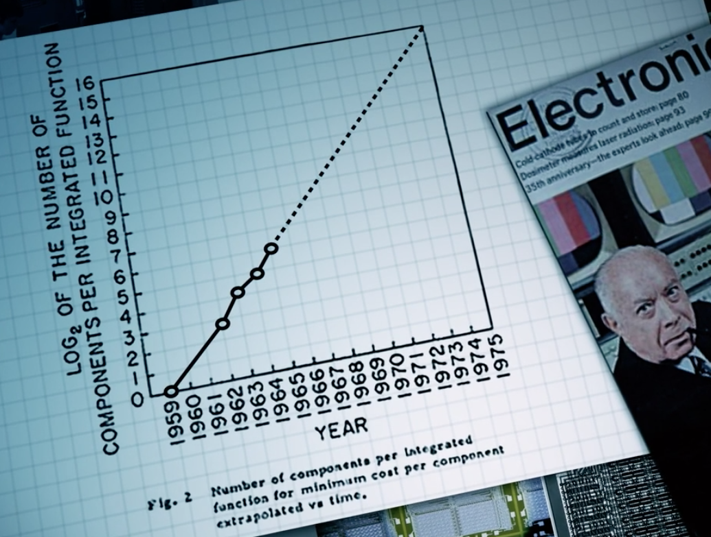
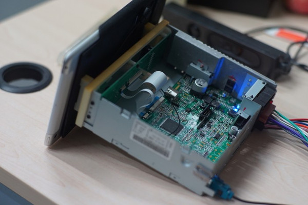
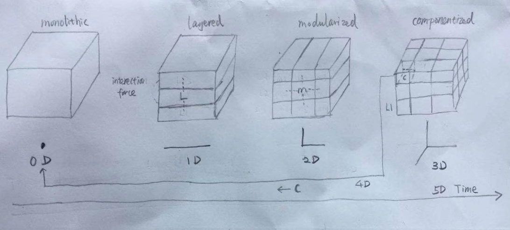
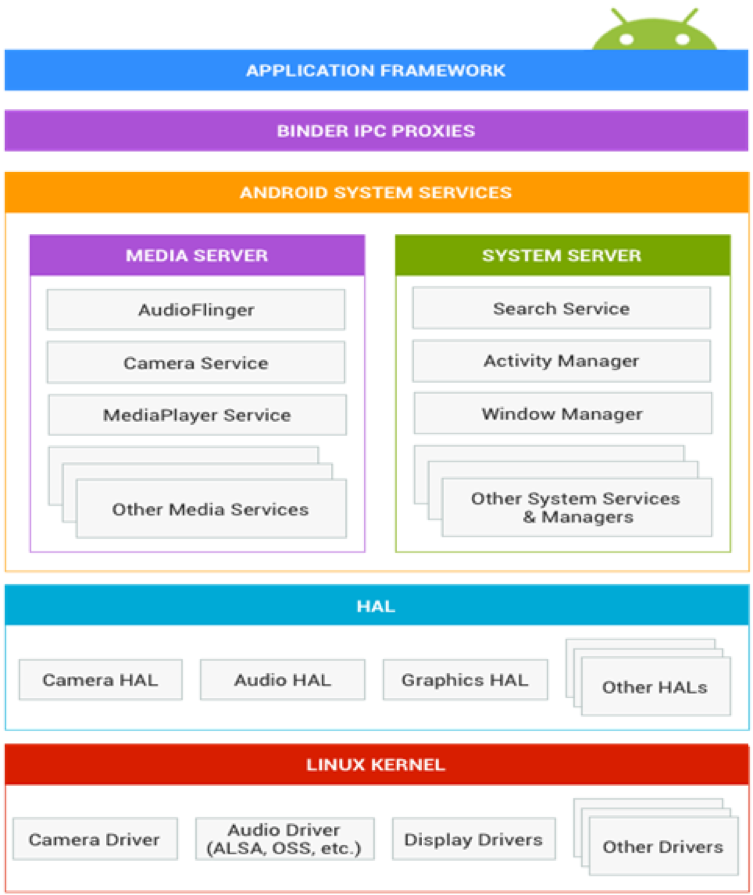
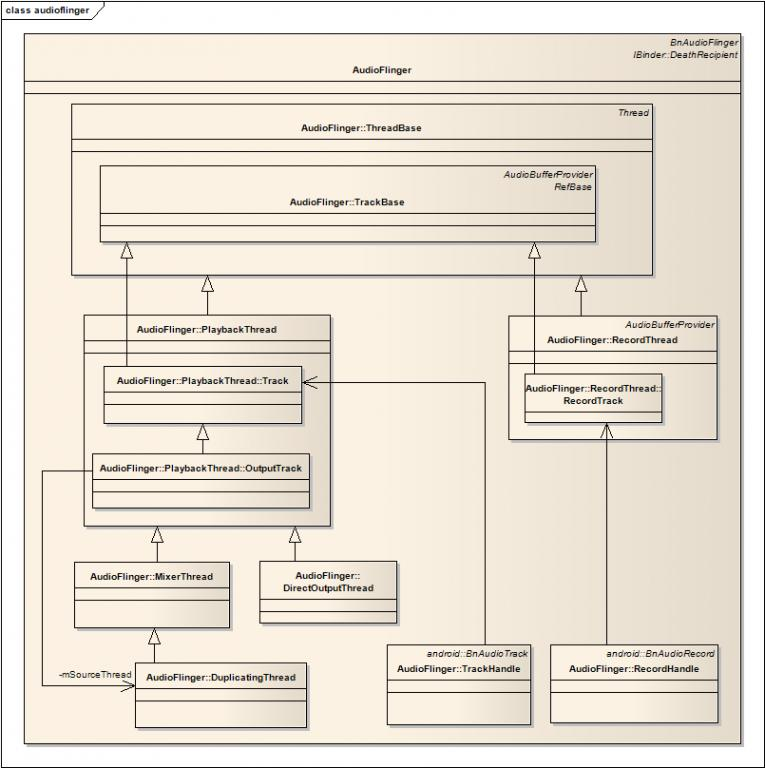
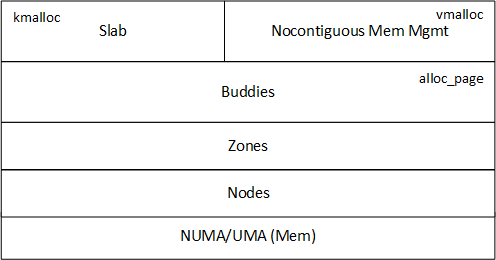
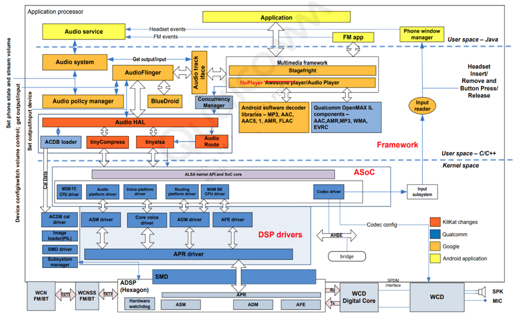

The Ingredients of Product
======================================

### Content
[toc]

### Version
| Version | Author   | Date       | Changes                |
| ------- | -------- | ---------- | ---------------------- |
| 0.1     | Jin Feng | 2019.10.04 | Initial Draft          |
| 0.2     | Jin Feng | 2019.10.18 | Redraw sketch          |

### Glossary
| Term | Definition                  |
| ---- | --------------------------- |
| IVI  | In-Vehicle Infortainment    |
| IPC  | Inter-Process Communication |
| HU   | Head Unit                   |

### Overview
The final IVI product is composed of touchable mechanical, visible hardware, and embedded software. Compared with the others the software is elaborate handiwork, its construction is fully brainwork, still no silver bullet for it. So more emphasis will be put on software.

### Mechanical
All mechanical parts are in three dimensional space. Contradictions become obvious, omissions can be caught with help of scale drawings of mechanical parts. A geometric reality is captured in a geometric abstraction.

  

***Figure 1***: The mechanical part of IVI[1]

### Hardware
In 1965, Gordon Moore made a prediction that would set the pace for our modern digital revolution. From careful observation of an emerging trend, Moore extrapolated that computing would dramatically increase in power, and decrease in relative cost, at an exponential pace. The insight, known as Moore’s Law, became the golden rule for the electronics industry, and a springboard for innovation.

 

***Figure 2***: Moore's Law

The computer hardware(electronic) progress is so fast. No other technology since civilization began has seen six orders of magnitude price-performance gain in 30 years. In no other technology can one choose to take the gain in either improved performance or in reduced costs. These gains flow from the transformation of computer manufacture from an assembly industry into a process industry[2].

  
***Figure 3***: The electronical parts of IVI[1]

### Software
Now numerous products are driving by software, however the software itself construct is still in the primitive peroid.  
  
  * **Handcraft Time**. Software construction is a creative process. Study after study shows that the very best designers produce structures that are faster, smaller, simpler, cleaner, and produced with less effort.
  
  * **No silver bullet**. There is no single development, in either technology or management technique, which by itself promises even one order-of-magnitude improvement within a decade in productivity, in reliability, in simplicity[2].
  
  * **Productivity variations**. These studies revealed large individual differences between high and low performers, often by an order of magnitude.

#### Properties  
All software construction involves essential tasks, the fashioning of the complex conceptual structures that compose the abstract software entity, and accidental tasks, the representation of these abstract entities in programming languages and the mapping of these onto machine languages within space and speed constraints[2]. The difficulties of software constuct can be divided into essence and accident.  

##### Essential Difficulties
  * **Complexity**. Software entities are more complex for their size than perhaps any other human construct, because no two parts are alike (at least above the statement level). If they are, we make the two similar parts into one, a subroutine, open or closed. In this respect software systems differ profoundly from computers, buildings, or automobiles, where repeated elements abound.  
  * **Conformity**. Software people are not alone in facing complexity. Physics deals with terribly complex objects even at the "fundamental" particle level. The physicist labors on, however, in a firm faith that there are unifying principles to be found, whether in quarks or in unified field theories. Einstein repeatedly argued that there must be simplified explanations of nature, because God is not capricious or arbitrary. No such faith comforts the software engineer.
  * **Changeability**. The software entity is constantly subject to pressures for change. the software product is embedded in a cultural ma- trix of applications, users, laws, and machine vehicles. These all change continually, and their changes inexorably force change upon the software product.
  * **Invisibility**. Software is invisible and unvisualizable. The reality of software is not inherently embedded in space. Hence it has no ready geometric representation in the way that land has maps, silicon chips have diagrams, computers have connectivity schematics. In spite of progress in restricting and simplifying the struc- tures of software, they remain inherently unvisualizable, thus depriving the mind of some of its most powerful conceptual tools. This lack not only impedes the process of design within one mind, it severely hinders communication among minds.
  
##### Accidental Difficulties
Past Breakthroughs such as high-level languages, time-sharing, unified programming envinroments, objected-oriented programming, artificial intellegence, graphical programming, and e.t.c solved Accidental Difficulties. 

##### Software Aging
Programs, like people, get old. We can't prevent aging, but we can understand its causes, take steps to liit its effects, temporarily reverse some of the damage it has caused, and prepare for the day when the software is no longer viable[3].

#### Promising Attacks  

##### Buy versus build  
The most radical possible solution for constructing software is not to construct it at all. Here "Buy versus build" has two meanings, one is to reuse existing modules and components as more as possible internally,  another is buy the mature commercial ones.  

##### Requirements refinement and rapid prototyping  
For the truth is, the clients do not know what they want. Therefore the most important function that software builders do for their clients is the iterative extraction and refinement of the product requirements.  

##### Incremental development  
grow, not build, software.  

##### Greate Designer  
The central question of how to improve the software art centers, as it always has, on people. Great designers and great managers are both very rare. Most organizations spend considerable effort in finding and cultivating the management prospects; I know of none that spends equal effort in finding and developing the great designers upon whom the technical excellence of the products will ultimately depend. A little retrospection shows that although many fine, useful software systems have been designed by committees and built by multipart projects, those software systems that have excited passionate fans are those that are the products of one or a few designing minds, great designers. Consider Unix, APL, Pascal, Modula, the Smalltalk interface, even Fortran; and contrast with Cobol, PL/I, Algol, MVS/370, and MS-DOS   

##### Modularity
In  the  journey  to  manage  complexity,  modularity  appears  as  a  crucial  strategy  enabling organizations  to  create  products  and services meeting individual customers’ needs while still leveraging the benefits of similarity and standardization[5].

##### 6D Software Construct
  

***Figure 4***: The initial draft of 6D software construct 

###### Methodologies
  **Abstract (xyz/space dimension)**  
  Abstract from top to down, from coase to fine, from outside to inside Recognize the static structure of an object from 3D space.   
  
  **Recurse (r dimension)**
  From my point of view recursion and fractal are the same in essence. We call this self-simulity fifth dimention which could guide us how to conquer an object.

  > “To see a world in a grain of sand. And a heaven in a wild flower.”  
  > 
 -- Buddha 

  **Depend (d dimension)**  
  The interaction forces presented among the particles make a bigger particle with specific functions and characteristics.

  **Grow (t dimension)**  
  Everything has life. The individual is growing, the race is envolving. Know the changes of an object from time dimention.
  
###### Algorithm
  1. Discretize the static structure  
     1.1. Layer  
     1.2. Modularize  
     1.3. Componentize  
  2. Specify interaction relationship among parts (here a part is layer, or module, or component)
  3. Continue to divide parts until they are simple to conquer
  4. Foster parts in each granularity from the primitive to the mature

#### Attitude
Since the software is inherently difficult, as a software engineer we should:  

* Keep humble
    
  > Knowledge makes humble, ignorance makes proud.  
  > 
 -- ???? 

* Keep learning

  > stay hungary, stay foolish
  > 
 -- Steven Jobs 

#### Example
Let's take Android system as exmaple and use 6D to Analyze

##### 0-D
Android is an operating system.  
  
***Figure 5***: The android perspective from 0-D

##### 1/2-D
The typical three layer overall architecture.  
  
***Figure 6***: The android perspective from 1/2-D

##### 3-D
We take AudioFlinger module from Android System Services Layer for example.  
  
***Figure 7***: The android perspective from 3-D

##### 4-D
Lots of parts from different layers can be discretized continully, such as memory management from linux kernel.  

***Figure 7***: The android perspective from 4-D

##### 5-D
Android grows and envolves quickly  
  
***Figure 7***: The android perspective from 5-D

##### 6-D
The parts communicate each other via direct calling, IPC, file system, and e.t.c.  

***Figure 8***: The android perspective from 6-D

### Conclusion
* The order of difficulies: mechanical < electronic << software
* Software construction is difficult in essence. No siver bullet now, but several methodoligies are helpful and promising.
* The 6D software construction is proposed initially

### References
1. http://www.sohu.com/a/42073902_120865
2. https://www.cs.drexel.edu/~yfcai/CS451/RequiredReadings/MythicalManMonth.pdf
3. https://www.researchgate.net/publication/3560773_Software_aging
4. https://www.jianshu.com/p/a676d4d959ae
5. https://orbit.dtu.dk/en/publications/complexity-management-for-projects-programmes-and-portfolios-an-e
