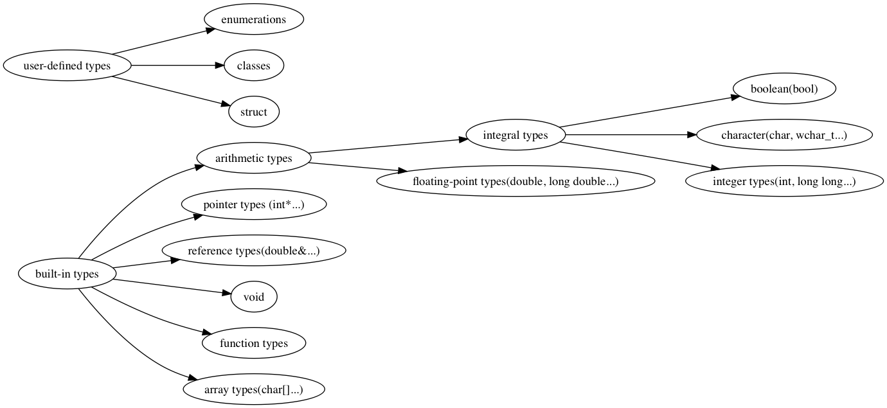

Types, Identifiers, Declarations, and Defintions in C++
=======================================================

# Contecnt
[toc]

# Version
| Version | Author   | Date        | Changes                            |
| ------- | -------- | ----------  | ---------------------------------  |
| 1.0     | Jin Feng | 2020.01.31  | Initial Draft                      |

# Overview

Have you been confused about **Types, Identifiers, Declarations, and Definitions**? This article could inspire you and help you understand it.

# Types
Every name (identifier) in a C++ program has a type associated with it. This type determines what operations can be applied to the name (that is, to the entity referred to by the name) and how such operations are interpreted.



# Identifiers
A name (identifier) consists of a sequence of letters and digits. The first character must be a letter. The underscoe character, _, is considered a letter.

# Declarations
Before a name (identifer) can be used in a C++ program, it must be declared. That is, its type must be specified to inform the compiler what kind of entity the name refers to. 

The structure of declarations:

> **declarations**:
> [prefixSpecifiers] baseType declarator [suffixFunctionSpecifier] [initializer | functionBody]
> 
> **prefixSpecifiers**: static, virtual  
> **baseType**: vector\<double\>, const int  
> **declarator**: p[7], n, \*(\*)[ ]  
> **suffixFunctionSpecifier**: const, noexcept  
> **initializer**: ={7, 5, 3}  
> **functionBody**: {return x;}

Here declarator is composed of a name (identifier) and optionally some declarator operators.

> **declarator**:
> [prefixOperator] identifier [postfixOperator]  
> **prefixOperator**: \*(pointer), *const(const pointer), \*volatile(volatile pointer), &(lvalue reference), &&(rvalue reference), auto(function,using suffix return type)  
> **postOperator**: \[\ ](array), ( )\<function\>, ->(return from function)

The postfix declarator operators bind tighter than the prefix ones. 

For example:
```c++
//
const char* kings[] = {"Antigonus", "Seleucus", "Ptolemy"};
char * kings1[];
char (* kings2)[];
```

# Definition
A declaration can do more than simply associate a type with a name. Most of these declarations are also definitions. A definition is a declaration that supplies all that is needed in a program for the use of an entity. in particular, if it takes memory to represent something, that memory is set aside by its definition. A different terminology deems declarations parts of interface and definitions parts of an implementation. 

* There must always be exactly one definition for each name (identifier) in a C++ program. However, there can be manyy declarations.
* Any declaration that specifies a value is a definition


# Declaration v.s. Definition

* A declaration is definition unless
   * it declares a function without specifying its body
   ```c++
     // header file
     void g();
     class Base {
         int f();
     }
   ```
   * it contains an *extern* specifier and no initializer or function body
   * it is the declaration of static class data member within a class definition
   ```c++
     // header file: Base.hpp
     class Base {
         static int i; // declaration, not definition
     }
   ```
   * it is a class name declaration, or
   * it is a typedef declaration

* A definition is a declaration unless:
   * it defines a static class data member or
   * it defines a no-inline member function
   ```c++
     // implemention file: Base.cpp
     int Base::i = 1; // definition, not declaration
     void Base::f(){}
   ```
* It is legal to repeat a declaration within a given scope. By contrast, there must be exactly one definition of each entity. The exceptions are function member declaration and data memeber declaration, may not be repeated whithin the definition of class:
```c++
class NoGood {
   static int i;
   static int i; // illegal
public:
   int f();
   int f(); // illegal
}
```

# Examples
Let us give you more exmamples to defferentiate declaration and definition
```c++
// declaration, not definition
void f();

// declaration and definition
void (g*)();

```

# References
2. <<Large-Scale C++ Software Design>> Chapter 1
3. <<The C++ Programming Language>> Forth Edition, Chapter 6


